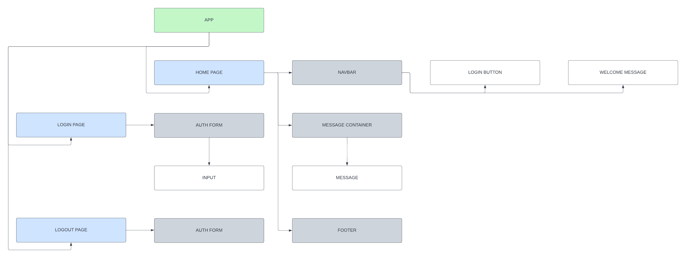
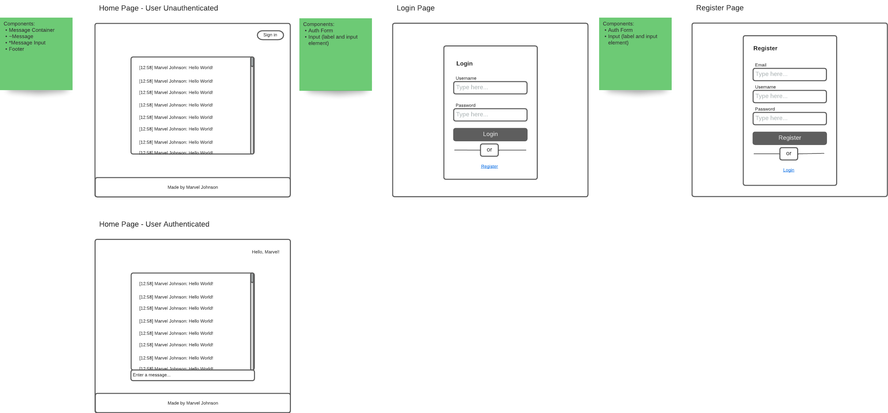
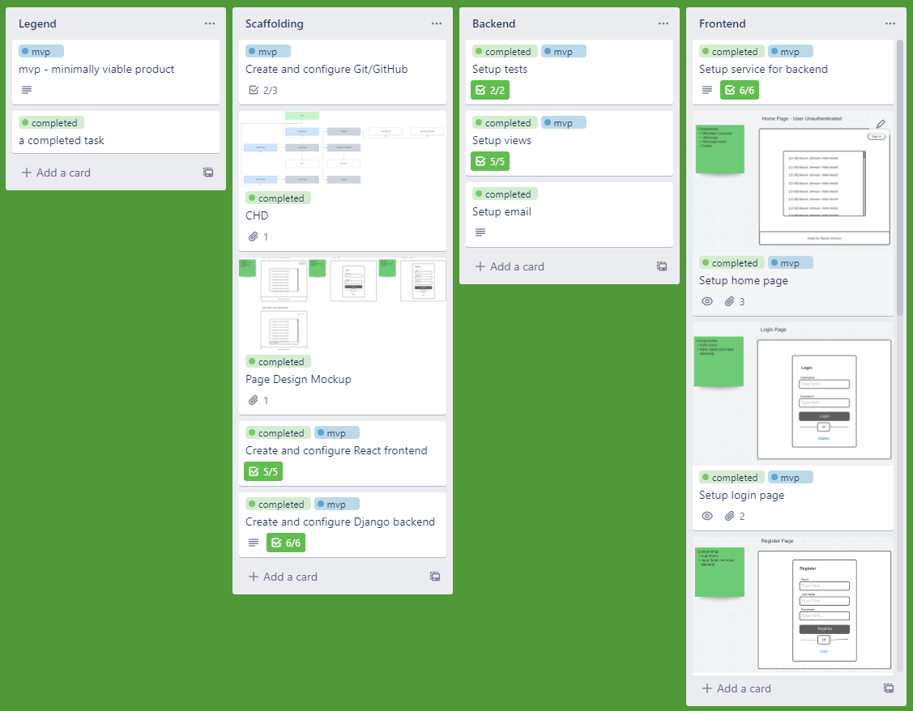

# Wall App

## Description

An interview assignment for The Silver Logic that is similar to Facebook's wall, where users log in and may post on a 'global wall' that everyone can see.

## Project Dependencies

- Python (3.8.10)
- Django (4.1.1)
  - django-cors-headers
  - django-environ
- Reactjs (18.2.0)
  - axios
  - react-router-dom
- SQLite3

## Overview

Wall App allows users to register a new account, login, and post messages to a global wall that other users can see. Upon registering for a new account, a welcome email is send to the user. User auth and sessions are managed by Django convenience libraries. There are also several test suits that ensure all Django views behave as expected.

## Setup

1. download the project
2. make sure you have python installed
3. make sure you have a python virtual environment manager installed (something like pipenv)

### Frontend

The steps outlined below assume you're using `npm`, but most of the popular package managers should work.
1. `cd` into the /frontend folder
2. run `npm install` to install the needed dependencies
3. run `npm run start` to spin up the development server
4. open up a separate terminal for the backend setup

### Backend

The steps outlined below assume you're using `pipenv`, but any python virtual environment manager should work.
1. `cd` into the /backend folder
2. enter the `pipenv` shell using `sudo pipenv shell`
3. install the project's backend dependencies using `pipenv install`
4. run `python manage.py migrate`
5. you can start the server by running the `python manage.py runserver` command

The view tests can be run by using `python manage.py test`.

For emails to be sent, you'll need to have an additional terminal instance open (besides the one for running the Django server). In that terminal, run `python -m smtpd -n -c DebuggingServer localhost:25`, ensuring you're still in the /backend directory.

## Organization

Component Hierarchy Diagram

Page Design Mockup

Project Management

## Resources

- [Trello](https://www.trello.com)
- [LucidApp](https://www.lucid.app)

## Credits
- Marvel Johnson
  - [LinkedIn](https://www.linkedin.com/in/marvel-johnson/)
  - [GitHub](https://github.com/MarvJohnson)
